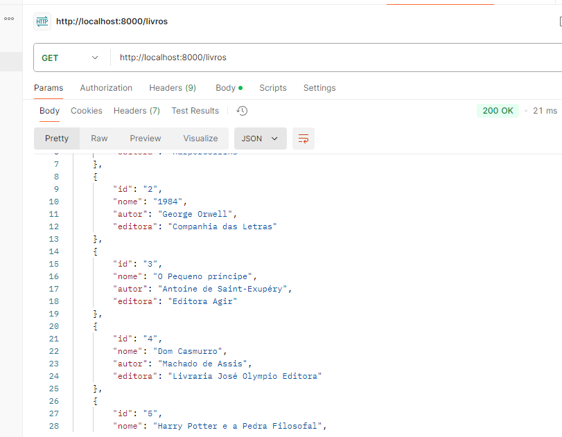
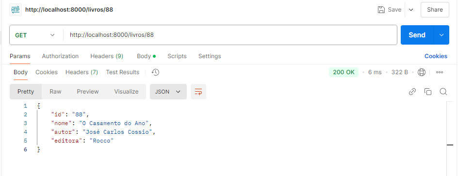
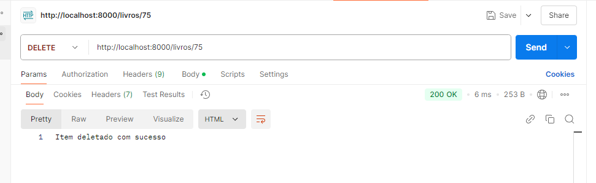
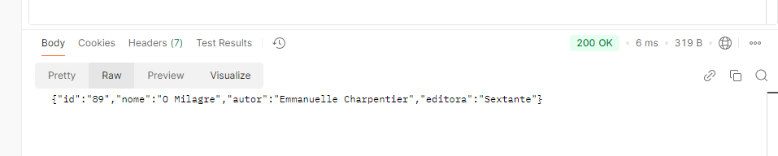
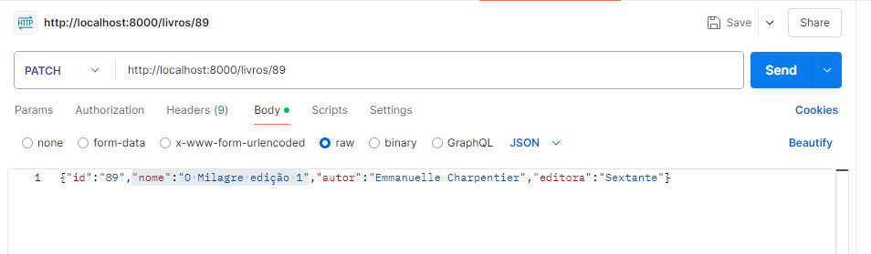
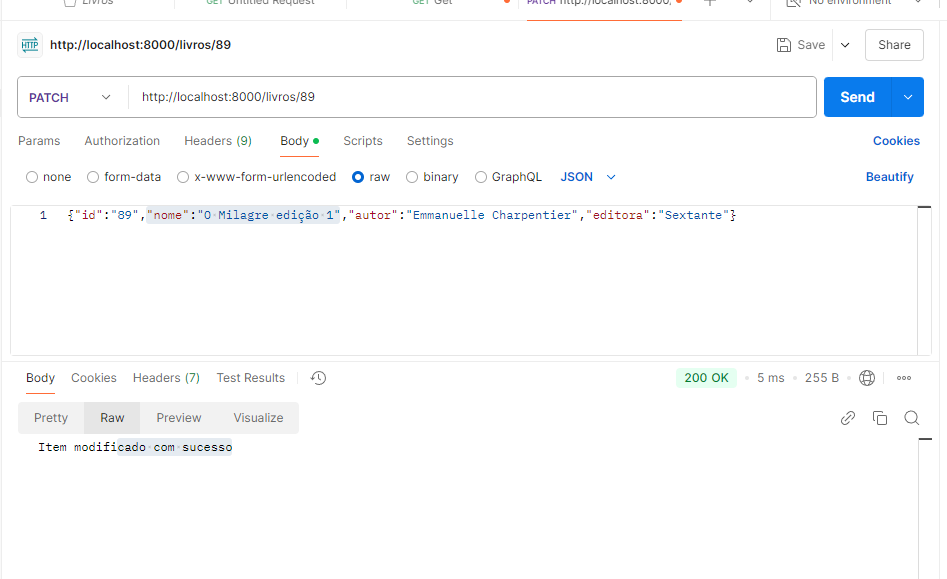
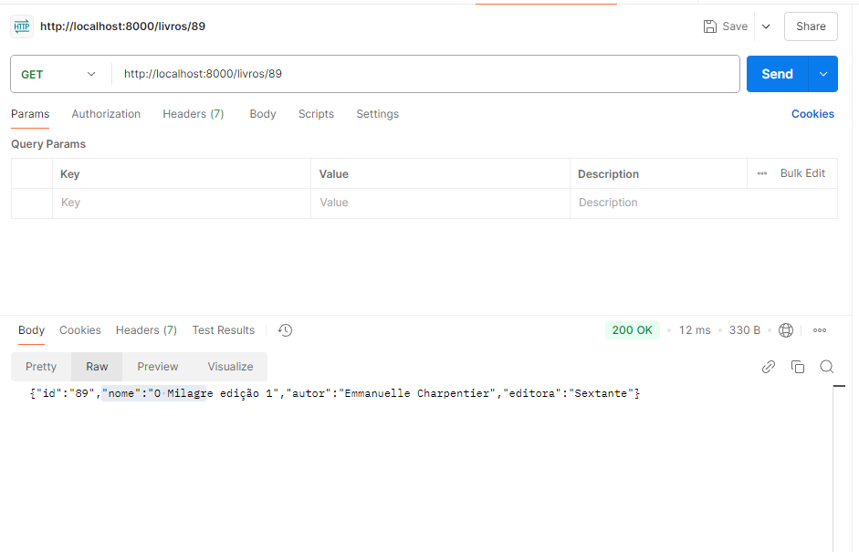

# API de Livros para Biblioteca

Este projeto é o backend de uma livraria, permitindo adicionar, atualizar, deletar e recuperar livros. Ele foi desenvolvido com o objetivo de criar uma API que pode ser consumida em um frontend de uma biblioteca de livros.

## Tecnologias Usadas
- **JavaScript**
- **Node.js**
- **Postman**

## Arquivo Utilizado
- **Formato do arquivo:** JSON

## Requisitos
- **Editor de Código:** VS Code
- **Versão do Node.js:** 18.20.5

---

## Como Rodar o Projeto

1. Clone o repositório:

   ```git clone https://github.com/ale-simoes12/back_biblioteca.git```

2. Acesse o diretório raiz do projeto e inicialize o NPM:

    ```npm init```

Siga as mensagens de configuração e personalize conforme sua preferência.

3. Instale o Express:

    ```npm install express```

4. Execute o projeto com o comando:


    ```nodemon app.js```

5. O projeto é executado na porta **8000** e pode ser acessado pela seguinte URL:

    ```http://localhost:8000/livros```

## Funcionalidades 


### Buscar lista de livros 



### Burcar livro pelo id




### Deletar livro pelo id




### Atualizar dados de um livro





**Novo valor "nome":"O Milagre" =>  "nome":"O Milagre edição 1"**





**Valor Alterado**




**Mostrar livro atualizado pelo get**


